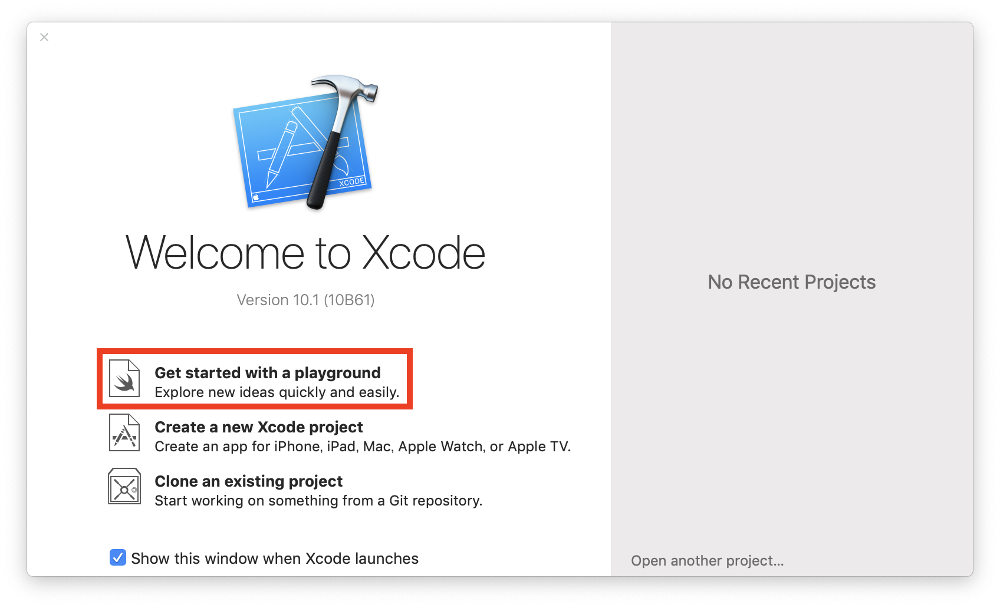
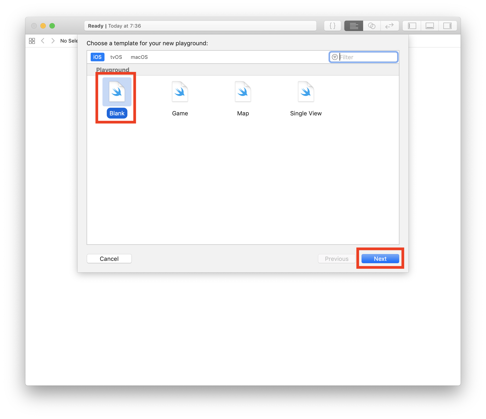
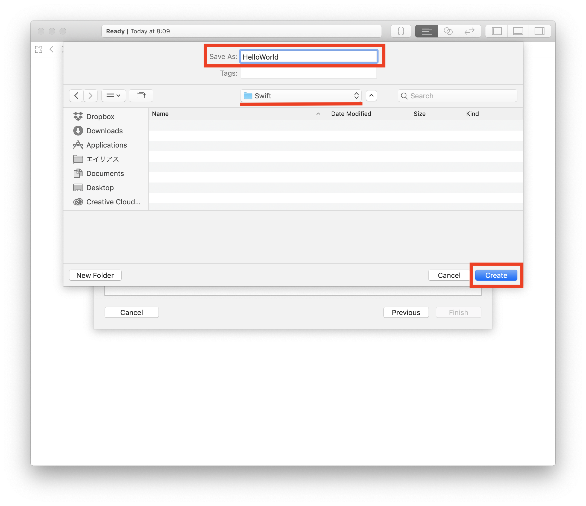
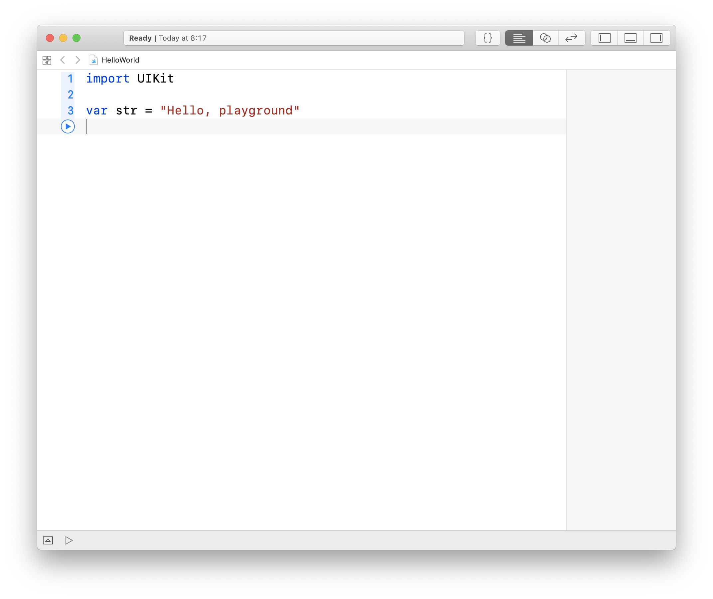
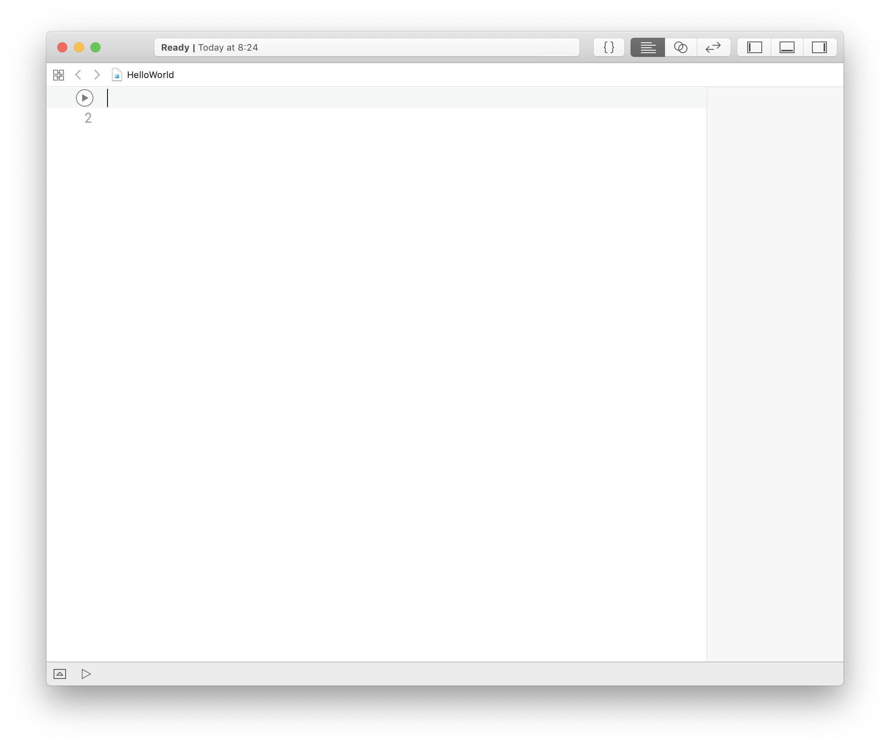
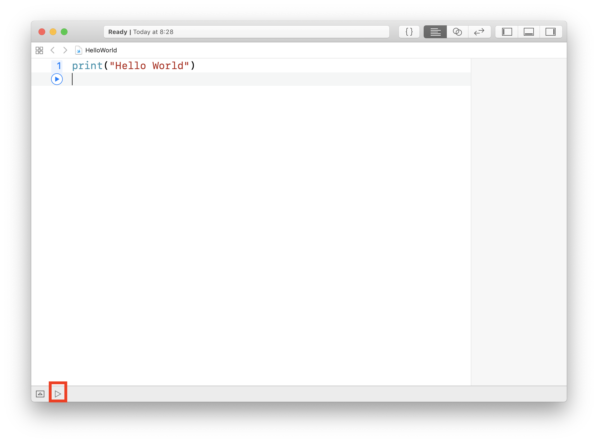

# はじめてのSwiftプログラミング
## このカリキュラムの目標
1. Playgroundプロジェクトが作成できるようになる
2. 「"Hello World"」という文字が出力できるようになる

## 導入
さっそくSwiftプログラムを始めていきます。  
まずは、プロジェクトの作り方と、「"Hello World"」という文字を出力するプログラムを作ってみましょう。


### Playgroundプロジェクトを作成する
#### Playgroundとは
> Playgroundとは英語で「遊び場」の意味。Xcodeには開発者が自由にSwiftプログラムを打ち込んでその場で結果を確認することができるPlaygroundという仕組みが組み込まれています。 

#### Xcodeを立ち上げる
> インストールしたXcodeを立ち上げてください。  
**Xcodeの見つけ方がわからない方は下の画像を参照**


#### Playgroundプロジェクトを作成する
1. 下の画像を参考にPlaygroundプロジェクト選択
	
	

2. 「Blank」を選択し、「Next」ボタンをクリック

	

3. プロジェクトの保存先を選択し、「Create」ボタンをクリック
	> プロジェクト名に「HelloWorld」と入力してください  
	
	**本記事ではデスクトップに「Swift」というフォルダを作り、その中にプロジェクトを保存しています**
	
	
	
	
4. 下記画像と同じような画面になれば、Playgroundプロジェクト作成完了です
	
	 


#### Hello Worldを出力するプログラムを書こう
先程作成したプロジェクトを編集していきます。

1. まずは不要なプログラムを全て消してください。

	> 下記画像のようになっていればOKです
	
	 
	
2. 以下のプログラムを書いてください
	
	```
	print("Hello World")
	```
	
3. 左下にある実行ボタンをクリック

	 
	
4. Hello Worldと出力されたら成功です

	 
