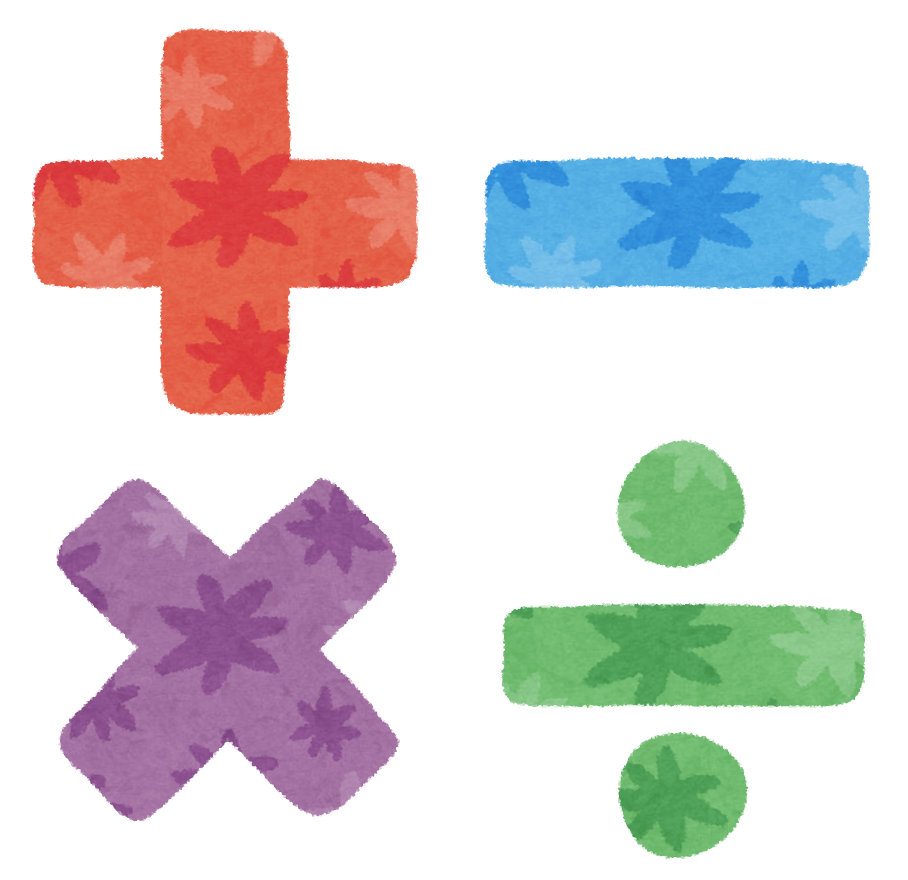

# 四則演算


## このカリキュラムの目標
1. プログラムを使って様々な計算ができるようになる

## 導入
Swiftには、数値に対して計算を行ったり連結を行ったりする演算子が用意されています。 

### 算術演算子とは
算術演算子とは、プログラムにおいて、**足し算**、**引き算**、**掛け算**、**割り算**等を行うために使う演算子のことです。  
数学の ＋ － × ÷ と同じものだと考えてください。

算術演算子の種類

|演算子|概要|例|
|---|---|---|
|+|足し算|x + y|
|-|	引き算|x - y|
|*|	掛け算|x * y|
|/|	割り算|x / y|
|%|	剰余算|x % y|

### 計算してみよう
1. 1 + 1を計算して、出力しましょう。

	```
	print(1 + 1)
	
	```
2. 5 - 1を計算して、出力しましょう。

	```
	print(5 - 1)
	
	```
	
3. 2 × 8を計算して、出力しましょう。

	```
	print(2 * 8)
	
	```
	
4. 6 ÷ 2を計算して、出力しましょう。

	```
	print(6 / 2)
	
	```

5. 5 ÷ 2を計算して、余りを出力しましょう。

	```
	print(5 % 2)
	
	```
	
### 練習問題
以下の変数を作成してくだい。

|変数名|値|
|---|---|
|a|5|
|b|	12|
|c|	13|
|d|	20|

```
var a = 5
var b = 12
var c = 13
var d = 20
```

1. 変数aと変数bと変数cを足した結果を出力してください。

	```
	print(a + b + c)
	```
	
2. 変数aと変数bを足した結果と変数cを掛けた結果を出力してください。

	```
	print((a + b) * c)
	```
	
3. 変数dから変数aを引いた結果を出力してください。

	```
	print(d - a)
	```
	
4. 変数bと変数cを掛けた結果を出力してください。

	```
	print(b * c)
	```
	
5. 変数dを変数aで割った結果を出力してください。

	```
	print(d / a)
	```
	
6. 変数dを変数cで割った余りを出力してください。

	```
	print(d % c)
	```