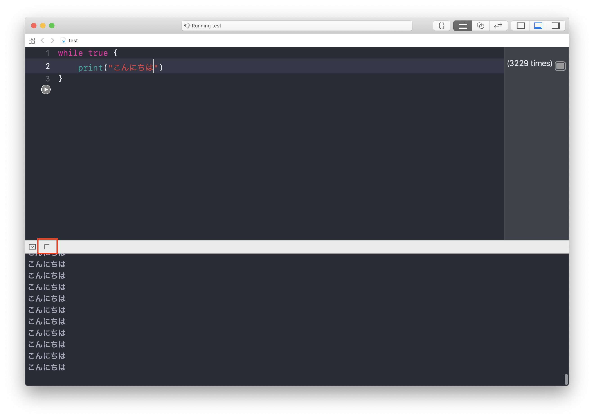

# 繰り返し文〜while文編〜

## このカリキュラムの目標
1. 繰り返し処理を簡単に書けるようになる。

## 導入
繰り返し処理の書き方には、for文の他にwhile文という書き方があります。  
for文との違いを理解し、while文も使えるようになりましょう。

### while文
1から10までの数字を出力するプログラムを考えてください。  
for文の場合、以下のようになると思います。

```
for i in 1...10 {
    print(i)
}
```

while文を使って、同じ処理を書くと以下のようになります。

#### while文の書き方

```
while 条件式 {
　　処理
}
```

例：（1から10までの数字を出力する場合）

```
var count = 1
while count <= 10 {
    print(count)
    count = count + 1
}
```

### 注意
以下のプログラムを見てください。

```
while true {
    print("こんにちは")
}
```

条件の部分が「true」になっており、while文の中にはループを抜ける処理が書かれていません。  
このようなループを**無限ループ**と言います。  
このプログラムを実行すると、無限に「こんにちは」という文字が出力されます。  
無限ループになってしまった時は、左下の停止ボタンを押すか、ショートカット「⌘+Q」でXcodeを終了してください。



### 練習問題
1. 1から100まで出力するプログラムを書いてください。
	
	<details><summary>回答例</summary><div>
	
	```
	var num = 1
	
	while num <= 100 {
	    print(num)
	    num = num + 1
	}
	```
	
	</div></details>
	
2. 1から100まで出力するプログラムを書いてください。  
ただし、50を出力したらbreakを使って、処理を中断するようにしてください。  
（1から50まで出力するようにしてください。）

	<details><summary>回答例</summary><div>
	
	```
	var num = 1
	
	while num <= 100 {
	    if num > 50 {
	        break
	    }
	    print(num)
	    num = num + 1
	}
	```
	
	</div></details>
	
3. 1から100までの奇数のみ出力するプログラムを書いてください。  
	<details><summary>回答例</summary><div>
	
	```
	var num = 1
	
	while num <= 100 {
	    if num % 2 == 0 {
	        num = num + 1
	        continue
	    }
	    print(num)
	    num = num + 1
	}
	
	```
	
	</div></details>