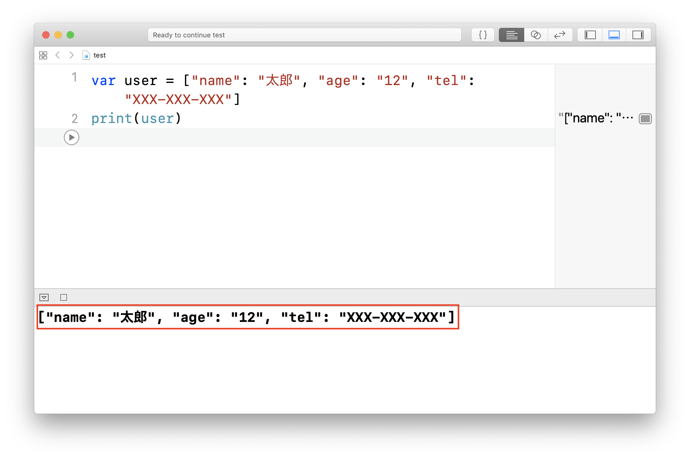
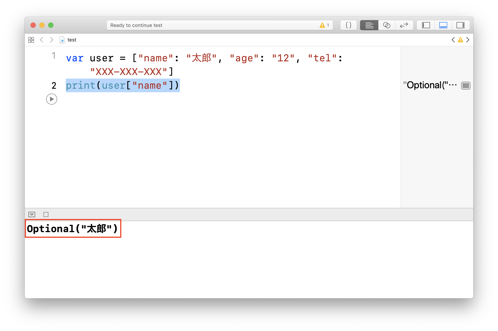

# ディクショナリー


## このカリキュラムの目標
1. ディクショナリーを理解する

## 導入
配列がタンスであるということを学習しました。
ディクショナリーも配列と同じくタンスですが、少し違いがあります。

### ディクショナリーとは
ディクショナリーも配列と同じで、**タンス**のことです。  
では、何が違うのかというと配列には0から順番に番号が振られていました。
ディクショナリーの場合、引き出しに対して自分で好きな名前を設定することができます。

#### ディクショナリーの作り方
ディクショナリーはこのように作ります。

```
var ディクショナリー名 = ["キー1": "値1", "キー2": "値2", "キー3": "値3"]
```

> キーの部分がタンスの引き出しの**名前**で、その引き出しの中に値が入っていると考えてください。

##### ディクショナリーを作ってみよう
それでは一緒にディクショナリーを作ってみましょう。   
以下のようなディクショナリーを作っていきたいと思います。

変数名：user

|キー|値|
|---|---|
|name|太郎|
|age|12|
|tel|XXX-XXX-XXX|

プログラミングコードは以下のようになります。

```
var user = ["name": "太郎", "age": "12", "tel": "XXX-XXX-XXX"]
```

##### 作った変数を出力してみよう
userという変数を作成しました。  
先ほど作った変数の中身をprintを使って出力してみましょう。

```
print(user)
```

出力結果



#### ディクショナリーの中身を取り出してみよう
ディクショナリーはタンスです。また引き出しには名前がついています。  
ディクショナリーから任意の値を取り出したい時には、この名前を使います。

#### 値の取り出し方

```
ディクショナリー[取り出したいの名前]
```

変数userから「太郎」を取り出したい場合、は以下のようになります。

```
print(user["name"])
```

以下のようになっていれば正解です。


#### ディクショナリーの値の追加
ディクショナリーに値を追加する場合は以下のように書きます。

```
ディクショナリー名.updateValue("値", forKey: "キー")
```

> キーが引き出しの名前、値が引き出しの中身になります。

例  
先ほど作成した変数userに「gender: male」を追加する場合、以下のようになります。

```
user.updateValue("male", forKey: "gender")
```

#### ディクショナリーの値の更新
ディクショナリーの値を更新する場合も追加と同じように書くことができます。

```
ディクショナリー名.updateValue("値", forKey: "キー")
```

例  
先ほど作成した変数userの「age」を「10」に更新する場合、以下のようになります。

```
user.updateValue("10", forKey: "age")
```

#### ディクショナリーの値の削除
ディクショナリーの値を削除する場合は以下のように書きます。

```
ディクショナリー名.removeValue(forKey: 削除したい要素のキー)
```

例  
先ほど作成した変数userの「age」を削除する場合、以下のようになります。

```
user.removeValue(forKey: "age")
```

### 練習問題