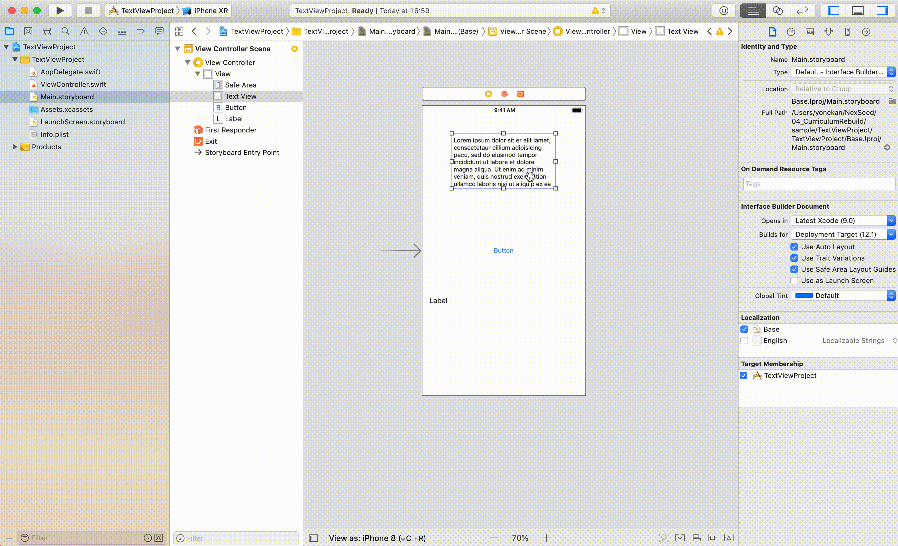
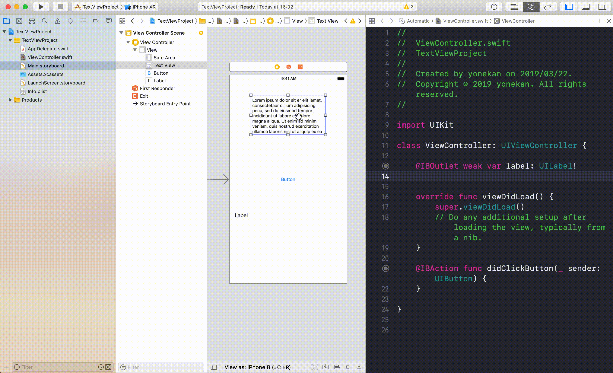

# UITextView

## 目標
- UITextViewが使えるようになる

## 開発の流れ

1. 画面の部品を配置する
	- UITextView, Button, Labelの設置
2. 配置した画面の部品をプログラムで扱えるよう設定する
3. Buttonが押された時の処理を書く

## 部品の説明

|部品名|概要|
|---|---|
| UITextView |文字の入力ができる（複数行）|

## 開発しよう

1. プロジェクトを作成する  
	[01_はじめてのアプリ開発](../01_はじめてのアプリ開発.md)と同じように新規プロジェクトを作成する。  
	アプリ名：TextViewProject
	
2. 画面の部品を配置する
	1. TextView, Button, Labelを配置する
		

	2. TextViewのデフォルトの文字を削除する
		TextViewを選択し、左から4つ目の属性インスペクタを選択。  
		Textの部分を全選択（Ctrl + a）し、削除する。
		

	3. Labelを複数行表示するように設定する。
	  Labelを選択し、左から4つ目の属性インスペクタを選択。
		Linesを0に設定する。 
		 

3. 配置した画面の部品をプログラムで扱えるよう設定する
	1. 画面と対になるプログラムファイルを開く。  
		プログラムファイルを開きたい画面を選択し、右上の∞に似たアイコンをクリックする。
		ViewController.swiftが開かれれば成功です。
		
		

	3. LabelをViewController.swiftに接続する。  
		接続のためのウィンドウが表示されたら、Name欄に「label」と入力し、「Connect」を選択。
		
		


	4. ButtonをViewController.swiftに接続する。  
	接続のためのウィンドウが表示されたら、Connection欄で「Action」を選択し、Name欄に「didClickButton」、Type欄に「UIButton」と入力し、「Connect」を選択。

	

  5. TextViewをViewController.swiftに接続する。  
	接続のためのウィンドウが表示されたら、Connection欄で「Outlet」を選択し、Name欄に「textView」と入力し、「Connect」を選択。

		


4. Buttonが押された時の処理を書く  
  ViewController内のdidClickButtonメソッドに以下のプログラムを追記する。

	``` 
	label.text = textView.text
	```
  
	didClickButtonの完成形

	```
	@IBAction func didClickButton(_ sender: UIButton) {
    	label.text = textView.text
	}
	```

5. プロジェクトを実行する。
	以下のように実行されれば成功です。
	

## 解説

### TextViewについて
``` 
label.text = textView.text 
```

上記のコードはlabelの文字に、画面で入力された値を設定しています。  
TextViewに入力された値は、TextViewのtextプロパティに保存されています。

### LabelのLinesについて
Labelはデフォルトでは1行のみしか表示できません。  
ですが、属性インスペクタ内のLinesの値を変更すれば、その値分の行数表示できます。  
例えば、Linesを3にすれば3行表示することが可能です。  
また、0行に設定すると表示できるだけ複数行表示してくれます。