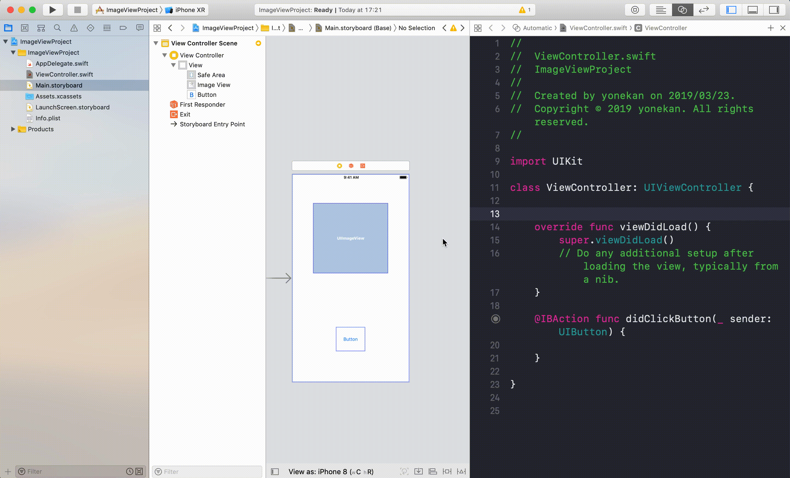
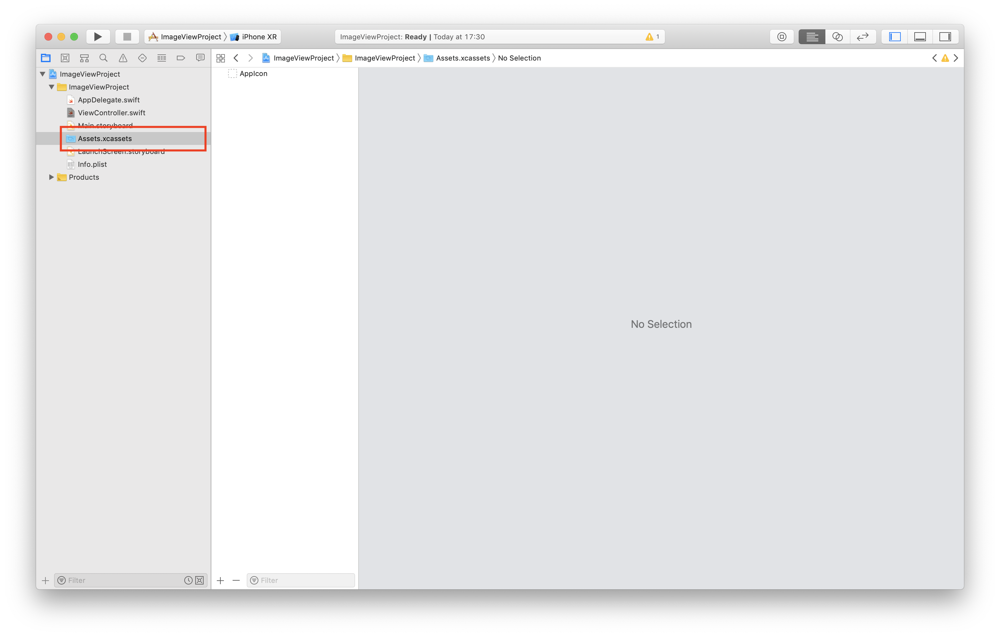
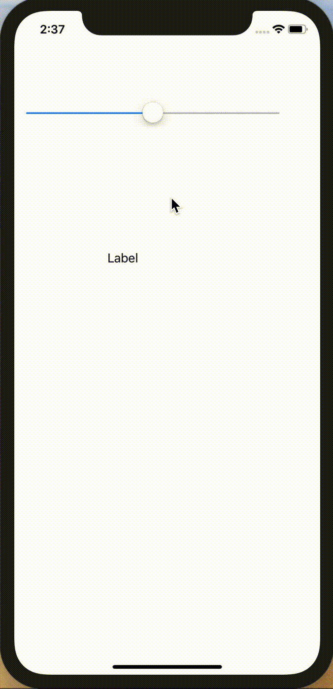

# UIImageView

## 目標
- UIImageViewが使えるようになうる

## 開発の流れ

1. 画面の部品を配置する
	- UIImageView, UIButtonの設置
2. 配置した画面の部品をプログラムで扱えるよう設定する
3. UIButtonが変更された時の処理を書く

## 部品の説明

|部品名|概要|
|---|---|
| UIImageView |画像を表示できる|

## 開発しよう

1. プロジェクトを作成する  
	[01_はじめてのアプリ開発](../s01_はじめてのアプリ開発.md)と同じように新規プロジェクトを作成する。  
	アプリ名：ImageViewProject
	
2. 画面の部品を配置する
	1. Slider, Labelを配置する
		

3. 配置した画面の部品をプログラムで扱えるよう設定する
	1. 画面と対になるプログラムファイルを開く。  
		プログラムファイルを開きたい画面を選択し、右上の∞に似たアイコンをクリックする。  
		ViewController.swiftが開かれれば成功です。

	2. ButtonをViewController.swiftに接続する。  
	接続のためのウィンドウが表示されたら、Connection欄で「Action」を選択し、Name欄に「didClickButton」、Type欄に「UIButton」と入力し、「Connect」を選択。

	

	3. SwitchをViewController.swiftに接続する。  
	接続のためのウィンドウが表示されたら、Connection欄で「Outlet」を選択し、Name欄に「imageView」を入力し、「Connect」を選択。

		

4. ImageViewに画像を追加する。
	1. ナビゲーターエリアから「Assets.xcassets」を選択する。

		

	2. [配布](./配布)フォルダから「cat.jpg」、「dog.jpg」をダウンロードする。

4. Switchが押された時の処理を書く  
  ViewController内のdidChangeValueメソッドに以下のプログラムを追記する。

	``` 
	label.text = "\(sender.value)"
	```
  
	didChangeValueの完成形

	```
	@IBAction func didChangeValue(_ sender: UISlider) {
        label.text = "\(sender.value)"
    }
	```

5. プロジェクトを実行する。
	以下のように実行されれば成功です。
	

## 解説

### Sliderについて

``` 
sender.value
```

この部分でスライダーの値を取得しています。  
スライダーの最小値と最大値は、デフォルトでそれぞれ 0.0 と 1.0 となっています。

また、スライダーの初期値を設定することもできます。
以下のようにSliderをIBOutletで接続して、```sender.value```に値を設定してください。

```
class ViewController: UIViewController {

	@IBOutlet weak var label: UILabel!
	
	// 追加
	@IBOutlet weak var slider: UISlider!
	
	override func viewDidLoad() {
		super.viewDidLoad()

		// 追加
		slider.value = 1
	}
	
	@IBAction func didChangeValue(_ sender: UISlider) {
		label.text = "\(sender.value)"
	}
    
}
```