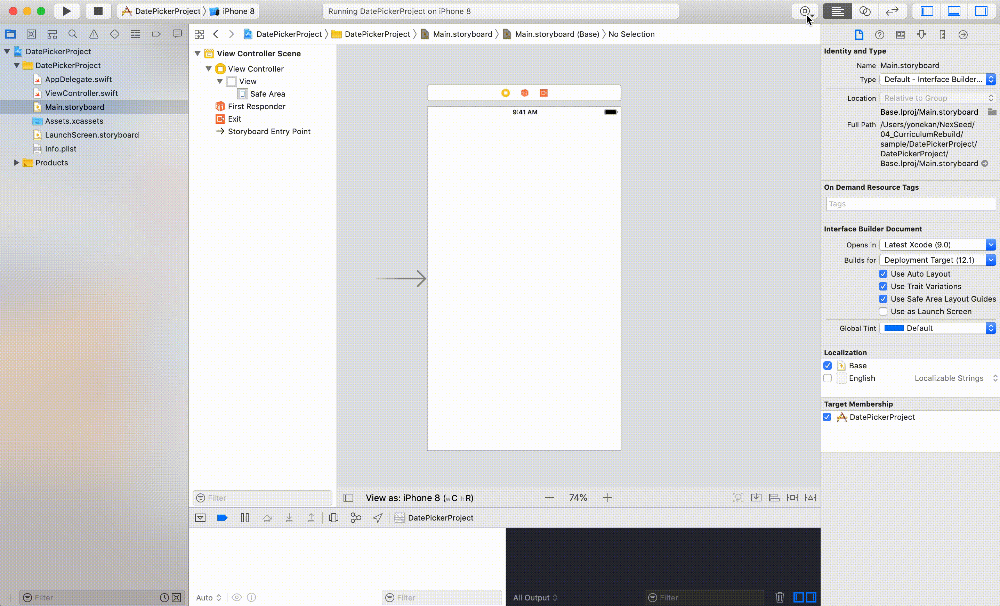

# UIDatePicker

## 目標
- UIDatePickerが使えるようになる

## 作成するアプリ  


## 開発の流れ

1. 画面の部品を配置する
	- UIDatePickerの設置
2. 配置した画面の部品をプログラムで扱えるよう設定する
3. プロジェクトに画像を追加する
4. UIDatePickerが変更された時の処理を書く

## 部品の説明

|部品名|概要|
|---|---|
| UIDatePicker |日付の選択ができる|

## 開発しよう

1. プロジェクトを作成する  
	[01_はじめてのアプリ開発](../01_はじめてのアプリ開発.md)と同じように新規プロジェクトを作成する。  
	アプリ名：DatePickerProject
	
2. 画面の部品を配置する
	1. UIDatePickerを配置する
	

3. 配置した画面の部品をプログラムで扱えるよう設定する
	1. 画面と対になるプログラムファイルを開く。  
		プログラムファイルを開きたい画面を選択し、右上の∞に似たアイコンをクリックする。  
		ViewController.swiftが開かれれば成功です。

	2. DatePickerをViewController.swiftに接続する。  
	接続のためのウィンドウが表示されたら、Connection欄で「Action」を選択し、Name欄に「didChangeValue」、Type欄に「UIDatePicker」と入力し、「Connect」を選択。

	

4. DatePickerの値が変更された時の処理を書く  
  ViewController内のdidChangeValueメソッドに以下のプログラムを追記する。

	``` 
	print(sender.date)  
	```
  
	didChangeValueの完成形

	```
	@IBAction func didChangeValue(_ sender: UIDatePicker) {
        print(sender.date)
    }
	```

5. プロジェクトを実行する。
	以下のように実行されれば成功です。
	

## 解説

### DatePickerについて
1. 値の取得方法
DatePickerの日付の値はdateプロパティが保持しています。  
```print(sender.date)```  
この部分でDatePickerのdateプロパティの日付を取得し、コンソールに出力しています。

2. DatePickerのフォーマット変更方法
Main.storyboardの属性インスペクタからDatePickerのフォーマットを変更できます。


