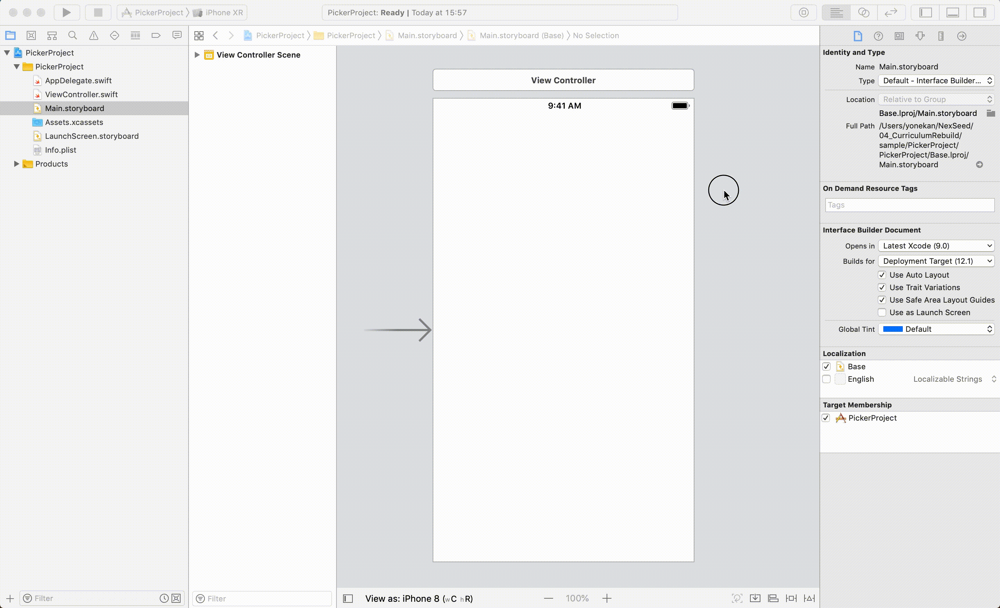
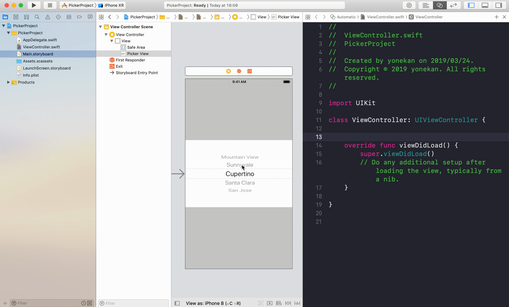
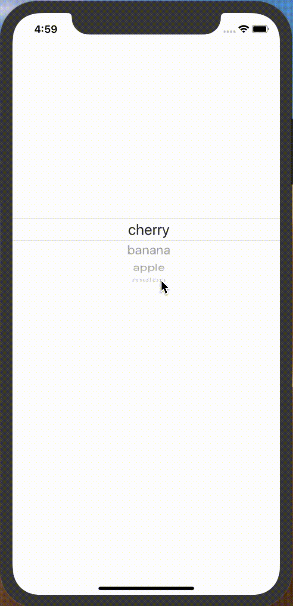

# UIPickerView

## 目標
- UIPickerViewが使えるようになる

## 開発の流れ

1. 画面の部品を配置する
	- UIPickerViewの設置
2. 配置した画面の部品をプログラムで扱えるよう設定する
3. UIPickerViewの設定を書く

## 部品の説明

|部品名|概要|
|---|---|
| UIPickerView |複数の選択肢から1つを選択できる|

## 開発しよう

1. プロジェクトを作成する  
	[01_はじめてのアプリ開発](../s01_はじめてのアプリ開発.md)と同じように新規プロジェクトを作成する。  
	アプリ名：PickerProject
	
2. 画面の部品を配置する
	1. UIPickerViewを配置する
	

3. 配置した画面の部品をプログラムで扱えるよう設定する
	1. 画面と対になるプログラムファイルを開く。  
		プログラムファイルを開きたい画面を選択し、右上の∞に似たアイコンをクリックする。  
		ViewController.swiftが開かれれば成功です。

	2. PickerViewをViewController.swiftに接続する。  
	接続のためのウィンドウが表示されたら、Connection欄で「Outlet」を選択し、Name欄に「pickerView」と入力し、「Connect」を選択。

	

4. UIPickerViewの設定を書く
	1. ViewController.swiftにPickerViewを使うためのプロトコルを追加する。

		> プロトコルとは**約束事**のことです。  
		> 今回の場合だと、PickerViewを使う際の約束事が定義されたファイルを追加していると考えてください。

		``` 
		class ViewController: UIViewController {
		```

		この部分を以下に以下の２つのプロトコルを追加してください。
		- UIPickerViewDelegate
		- UIPickerViewDataSource

		修正後のViewController

		```
		class ViewController: UIViewController, UIPickerViewDelegate, UIPickerViewDataSource {
		```
  
	2. UIPickerViewの行数と、UIPickerViewの表示する内容を定義する。
		> UIPickerViewDelegate, UIPickerViewDataSourceを追加するとエラーが発生したと思います。  
		> PickerViewに必要な約束事を定義していないからです。  
		> これからその約束事をそれぞれ定義していきましょう。

		1. 設定に必要な関数を追加する。
			以下の２つの関数をviewDidLoadの下に追加してください。

			```
			func numberOfComponents(in pickerView: UIPickerView) -> Int {
				<#code#>
			}
			
			func pickerView(_ pickerView: UIPickerView, numberOfRowsInComponent component: Int) -> Int {
				<#code#>
			}
			```

			追加後のViewController

			```
			class ViewController: UIViewController, UIPickerViewDelegate, UIPickerViewDataSource {

					@IBOutlet weak var pickerView: UIPickerView!
				
					override func viewDidLoad() {
							super.viewDidLoad()
					}
		
					func numberOfComponents(in pickerView: UIPickerView) -> Int {
							<#code#>
					}
				
					func pickerView(_ pickerView: UIPickerView, numberOfRowsInComponent component: Int) -> Int {
							<#code#>
					}
			}
			```

			各メソッドの説明

			|メソッド名|概要|
			|---|---|
			|numberOfComponents|PickerViewの列数を設定する|
			|func pickerView(_ pickerView: UIPickerView, numberOfRowsInComponent component: Int)|PickerVIewの行数を設定する|
			|func pickerView(_ pickerView: UIPickerView, titleForRow row: Int, forComponent component: Int)|PickerViewに表示する内容を設定する|

		2. PickerViewに表示する内容を保持した配列を追加する。  
			以下のような配列を作成し、下記のプログラムの下に定義してください。  
			```@IBOutlet weak var pickerView: UIPickerView!```  


			|配列名|内容|
			|---|---|
			|fruits|cherry, banana, apple, melon|
			
			<details><summary>回答例</summary><div>
	
			```
			@IBOutlet weak var pickerView: UIPickerView!
    
			let fruits = ["cherry", "banana", "apple", "melon"]
			
			override func viewDidLoad() {
					super.viewDidLoad()
			}
			```
			</div></details>

		3. UIPickerViewの列数を定義する。  
		  numberOfComponentsメソッドに以下のプログラムを追記する。

			```
			return 1
			```

			numberOfComponentsの完成形

			```
			func numberOfComponents(in pickerView: UIPickerView) -> Int {
      			return 1
    		}
			```

		4. UIPickerViewの行数を定義する。  
		  func pickerView(_ pickerView: UIPickerView, numberOfRowsInComponent component: Int)メソッドに以下のプログラムを追記する。

			```
			return fruits.count
			```

			func pickerView(_ pickerView: UIPickerView, numberOfRowsInComponent component: Int)の完成形

			```
			func pickerView(_ pickerView: UIPickerView, numberOfRowsInComponent component: Int) -> Int {
        return fruits.count
    	}
			```

			> 解説
			> PickerViewには配列に格納されたフルーツ名を順番に全て表示するので、  
			> 配列の要素数を返すcountメソッドを使ってPickerViewの行数を設定しています。

		5. UIPickerViewに表示する内容を定義する。  
		  func pickerView(_ pickerView: UIPickerView, titleForRow row: Int, forComponent component: Int)に以下のプログラムを追記する。

			```
			return fruits[row]
			```

			func pickerView(_ pickerView: UIPickerView, titleForRow row: Int, forComponent component: Int)の完成形

			```
			func pickerView(_ pickerView: UIPickerView, titleForRow row: Int, forComponent component: Int) -> String? {
        		return fruits[row]
    		}
			```
	
			> 解説
			> ここでは1行目から最後の行まで表示する文字を設定します。  
			> 引数rowには何行目かの行番号が入っています。1行目の場合にはrowに0が入っています。  
			> 今回は配列fruitsが保持する文字を順番に表示したいので、```fruits[row]```としています。

		6. 画面のPickerViewに設定を反映する。
		  ここまででViewControllerに以下の設定を追加しました。

			- UIPickerViewの列数
			- UIPickerViewの行数
			- UIPickerViewに表示する内容

			これらの設定を```@IBOutlet weak var pickerView: UIPickerView!```に反映させましょう。  
			viewDidLoadに以下のプログラムを追記してください。

			```
			pickerView.delegate = self
      pickerView.dataSource = self
			```

			viewDidLoadの完成形

			```
			override func viewDidLoad() {
        super.viewDidLoad()
        
        pickerView.delegate = self
        pickerView.dataSource = self
    	}
			```

5. プロジェクトを実行する。
	以下のように実行されれば成功です。
	

## 解説

### DatePickerについて
1. 値の取得方法
DatePickerの日付の値はdateプロパティが保持しています。  
```print(sender.date)```  
この部分でDatePickerのdateプロパティの日付を取得し、コンソールに出力しています。

2. DatePickerのフォーマット変更方法
Main.storyboardの属性インスペクタからDatePickerのフォーマットを変更できます。


