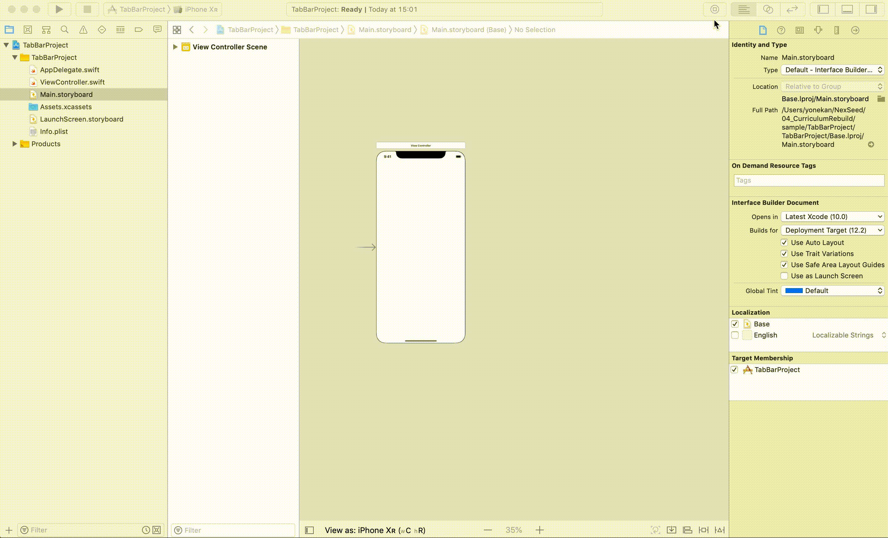
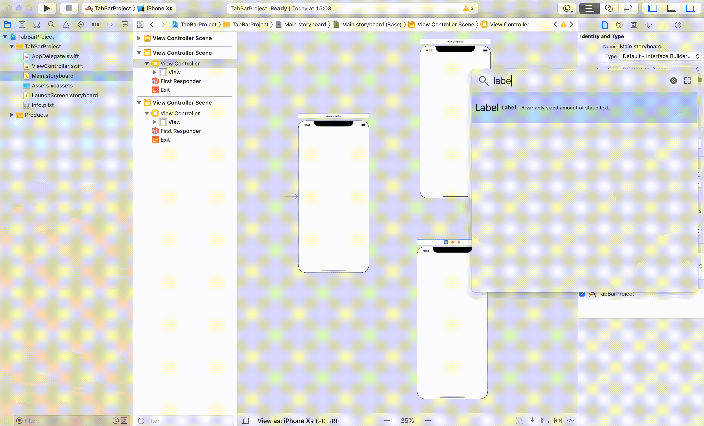
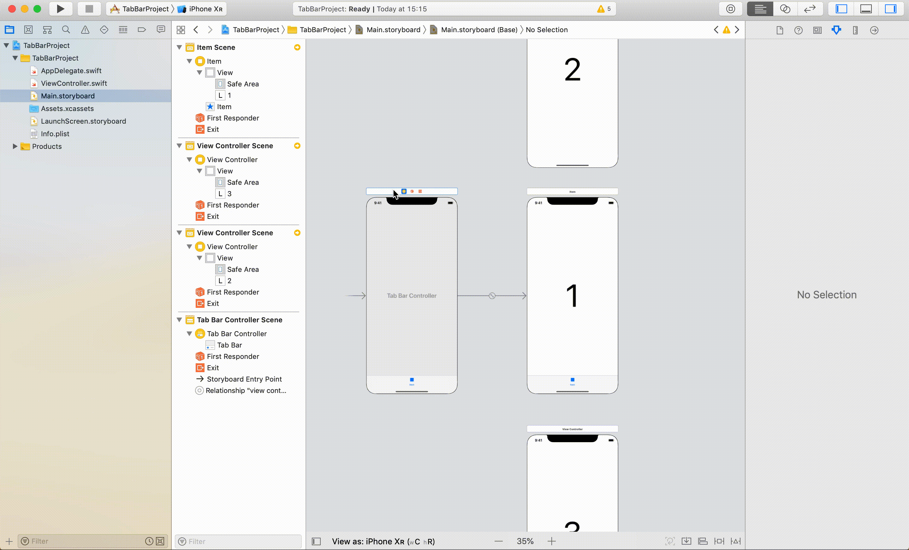
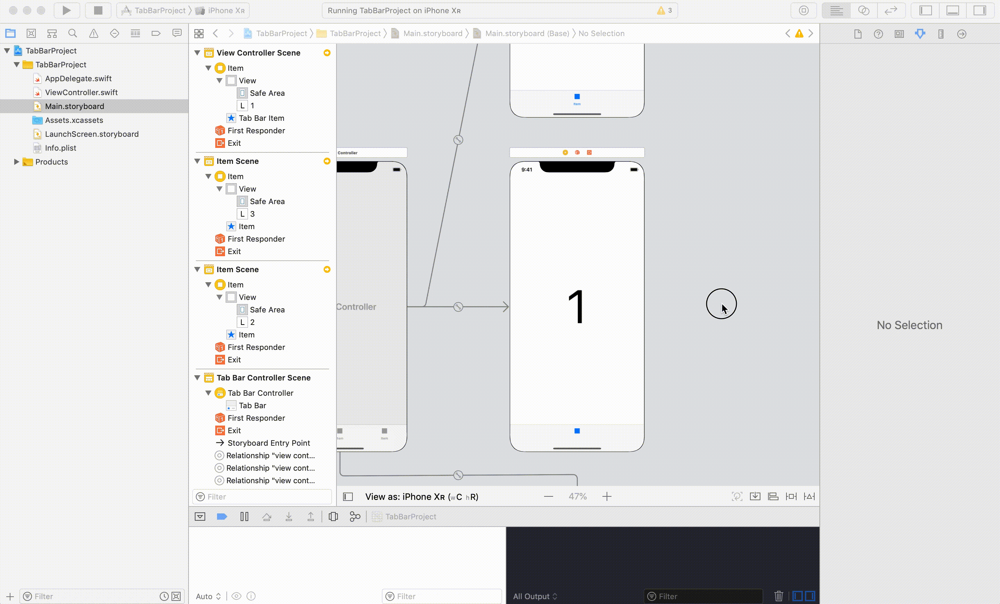

# UITabBarController

## 目標
- UITabBarControllerが使えるようになる

## 作成するアプリ  

## 開発の流れ

1. 画面の部品を配置する
	- ViewControllerの設置
	- Labelの設置
2. UITabBarControllerの設置

## 部品の説明

|部品名|概要|
|---|---|
| UITabBarController |タブによるページの切り替えが実装できる|

## 開発しよう

1. プロジェクトを作成する  
	[01_はじめてのアプリ開発](../01_はじめてのアプリ開発.md)と同じように新規プロジェクトを作成する。  
	アプリ名：TabBarProject
	
2. 画面の部品を配置する
	1. ViewControllerを2つ配置する
		

	2. 各画面にLabelを配置する
		

3. UITabBarControllerの設置
	1. 最初の画面を選択し、上のメニューから「Editor」→「Embed in」→ 「Tab Bar Controller」を選択する

		

	2. 他の画面をタブメニューに追加する。
		TabBarControllerを選択し、Ctrlキーを押しながら、ViewControllerまでドラッグする。 
		接続時に表示されたウィンドウで、「view controllers」を選択する

		
	
5. 実行してみる。  
	以下のように実行されればOKです。  

	

6. TabBarにアイコンを設定してみる。  
	アイコンを設定したいコントローラー内のタブを選択し、ユーティリティエリアの属性インスペクタを選択する。  
	System Itemから任意のアイコンを選択する。

	
	
7. アイコンを設定して実行してみる。  

	