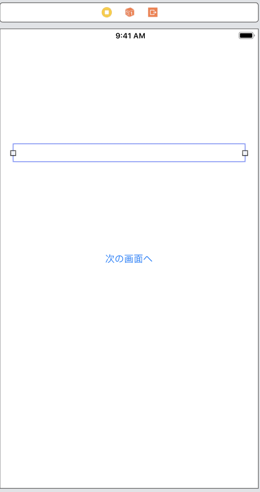
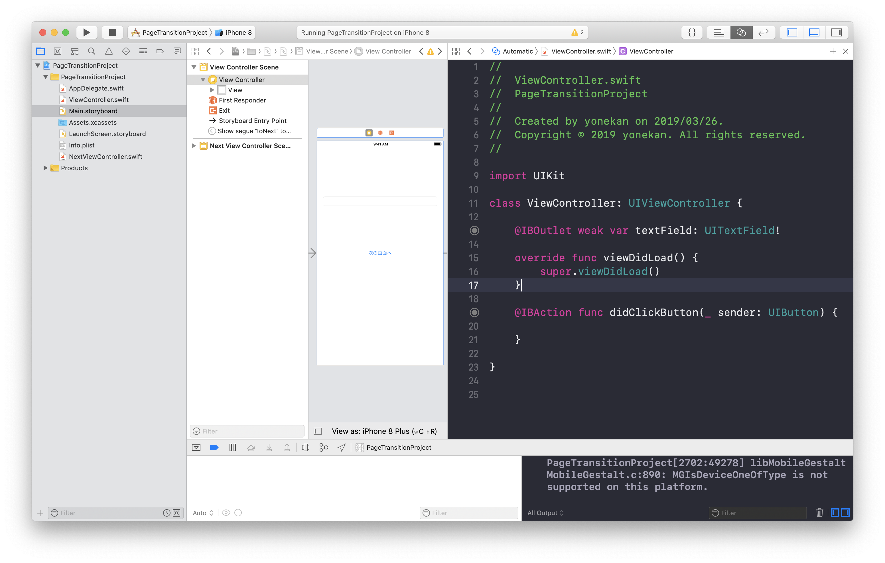
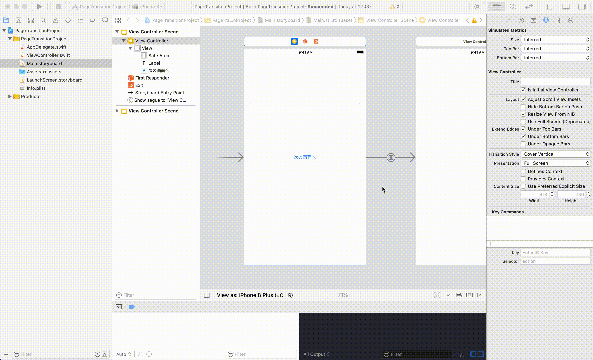
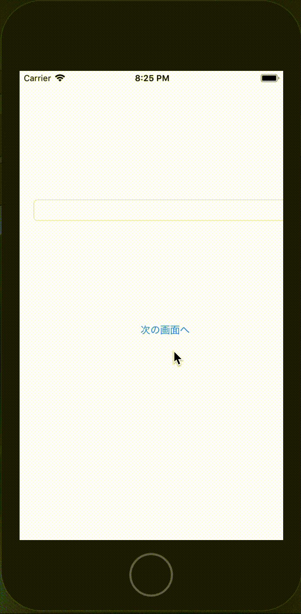
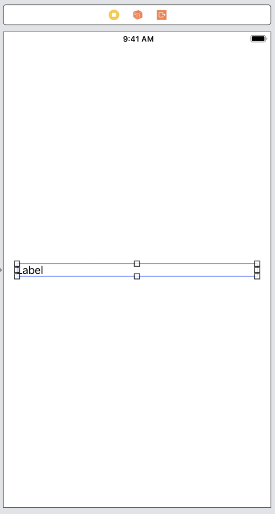
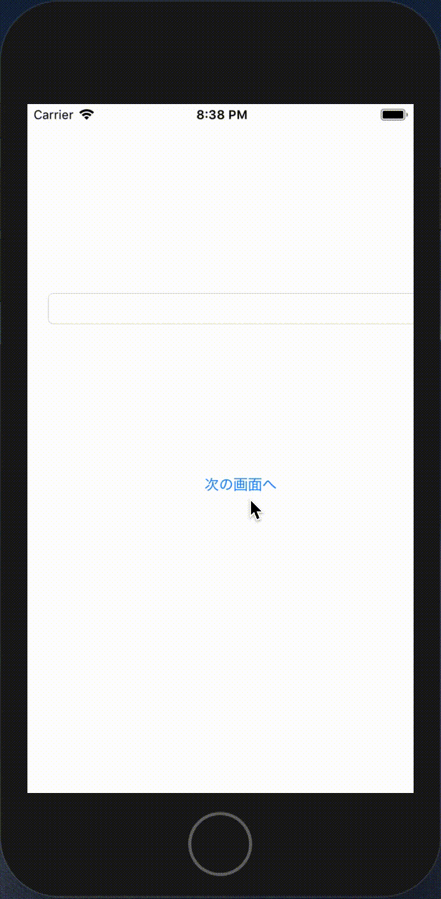

# 画面遷移

## 目標
- 画面遷移ができるようになる

## 開発の流れ

1. 画面の部品を配置する
	- UIButtonの設置
	- UITextFieldの設置
	- ViewController（次画面）の設置
2. 画面遷移の処理を書く
3. 次画面に値を渡す処理を書く

## 開発しよう

1. プロジェクトを作成する  
	[01_はじめてのアプリ開発](../01_はじめてのアプリ開発.md)と同じように新規プロジェクトを作成する。  
	アプリ名：PageTransitionProject
	
2. 画面の部品を配置する
	1. TextField, Buttonを以下のように配置する。
		

	2. ViewController（次画面）を配置する。
		

3. 配置した画面の部品をプログラムで扱えるよう設定する
	1. 配置したTextField, ButtonをViewController.swiftに接続する。
	|部品|接続時のName|
	|---|---|
	|UITextField|textField|
	|UIButton|didClickButton|

	

4. 画面遷移の処理を書く
	1. Main.storyboardでTop画面と次画面を接続する。
		TOP画面を選択し、Ctrlキーを押しながら、次画面までドラッグする。 
		接続時に表示されたウィンドウで、「show」を選択する

		

	2. 画面遷移の接続を表す矢印に識別子（名前）を設定する
		矢印を選択し、ユーティリティエリアの属性インスペクタを選択する。  
		identifierに「toNext」と入力する。

		

	3. didClickButtonで画面遷移の処理を書く
		以下の処理をdidClickButtonに追記する。
		```
		performSegue(withIdentifier: "toNext", sender: nil)
		```

		追記後のdidClickButton
		```
		@IBAction func didClickButton(_ sender: UIButton) {
			performSegue(withIdentifier: "toNext", sender: nil)
		}
		```

	4. 実行してみる
		以下のようになればOKです
		
		

5. 次画面に値を渡す処理を書く
	1. 次画面の準備
		1. NextViewController.swiftを作成する
			

		2. 作成したNextViewController.swiftをMain.storyboardの次画面と接続する
			

		3. UILabelを配置する
			UILabelを以下のように配置する。
			

		4. 配置したUILabelをNextViewController.swiftに接続する。
			|部品|接続時のName|
			|---|---|
			|UILabel|label|

			

		5. 次画面から入力値を受け取る変数を用意する。
			```@IBOutlet weak var label: UILabel!```の下に変数value（初期値：空です）を用意する。  
			また、```viewDidLoad```で変数valueの値をlabelに設定するプログラムを追記する。

			変数valueを追加後のNextViewController

			```
			class NextViewController: UIViewController {

    		@IBOutlet weak var label: UILabel!
    
    		var value = "空です"
    
    		override func viewDidLoad() {
        	super.viewDidLoad()
        
        	label.text = value
    		}

			}
			```

			6. 実行してみる
				以下のようになればOKです
		
				
			
	2. ViewController.swiftでNextViewController.swiftに値を渡す処理を書く
		