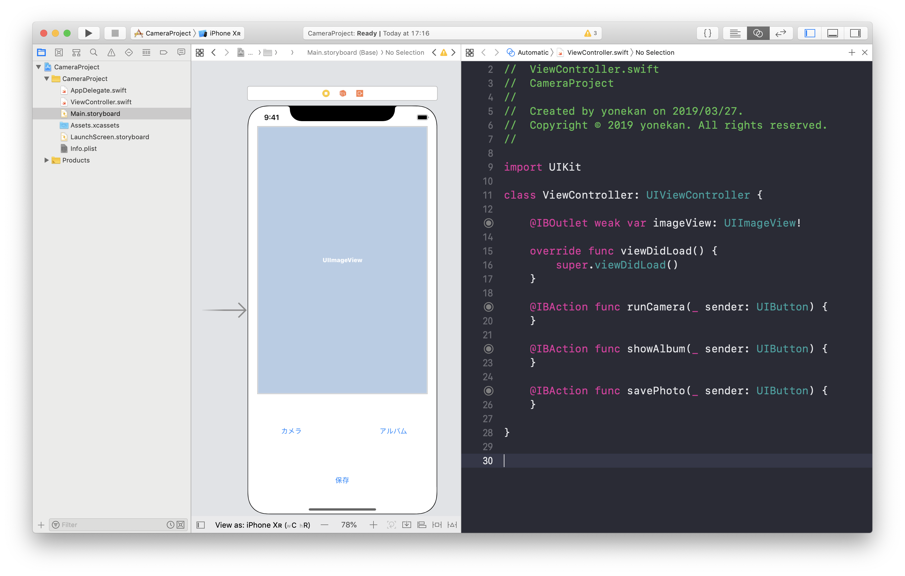
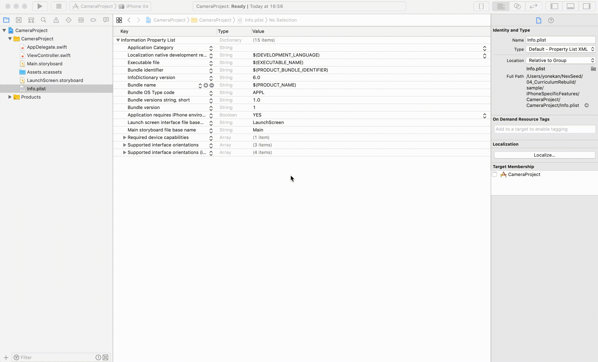

# Camera  

## 目標
- カメラが使えるようになる

## 作成するアプリ

## 開発の流れ
1. 画面の部品を配置する
2. カメラ・フォトライブラリのアクセス利用設定
3. カメラ撮影機能
4. フォトライブラリ表示
5. 写真保存機能

## 開発しよう
1. プロジェクトを作成する  
  アプリ名：CameraProject

2. 画面の部品を配置する
    1. 以下のような画面になるよう部品を配置する  
        
  
    2. 配置した部品をViewController.swiftに接続する。
    
        |部品|接続時のName|
        |---|---|
        |UIImageView|imageView|
        |UIButton（カメラ）|runCamera|
        |UIButton（アルバム）|showAlbum|
        |UIButton（保存）|savePhoto|

        

3. ユーザー許可の設定をする
  Info.plistに以下のKeyとValueをを追加する

  - NSCameraUsageDescription
    - Privacy – Camera Usage Description
  - NSPhotoLibraryAddUsageDescription
    - Privacy – Photo Library Additions Usage Description

  |Key|内容|
  |---|---|
  |Privacy – Camera Usage Description|アプリがカメラを使用する許可設定|
  |Privacy – Photo Library Additions Usage Description|アプリがフォトライブラリに追加する許可設定|

  1. 左のナビゲータ領域からInfo.plistを選択する。
    

  2. 「Privacy – Camera Usage Description」を追加する。
    
  
  3. 「Privacy – Photo Library Additions Usage Description」を追加する。
    
