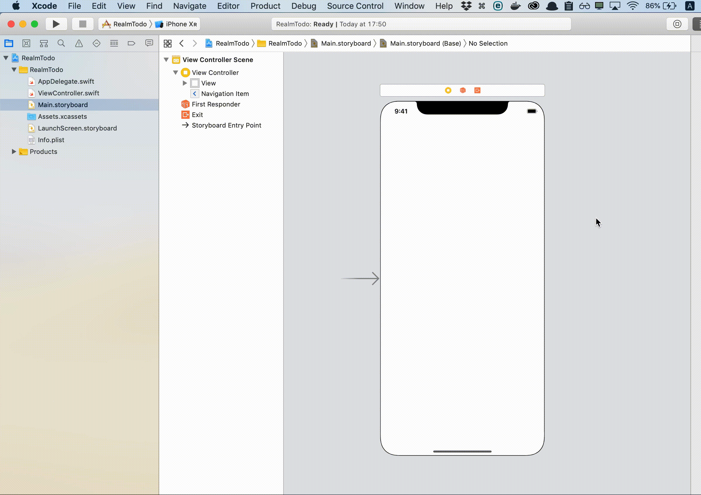
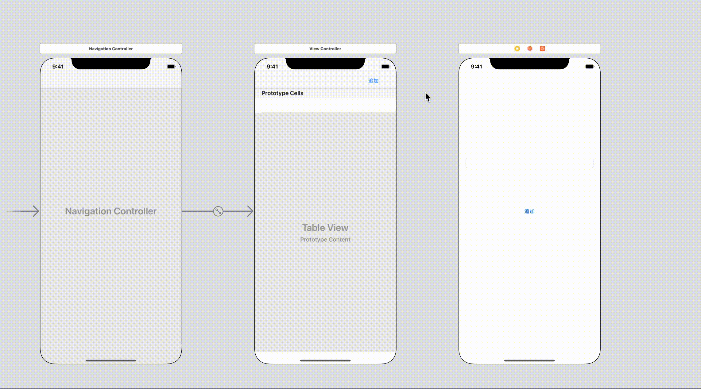
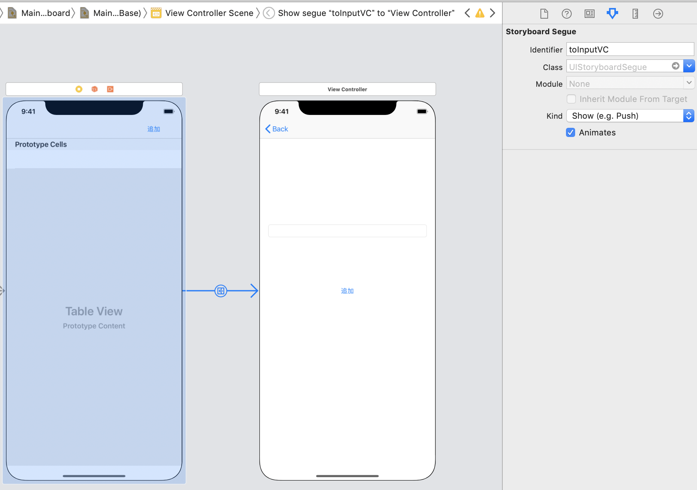
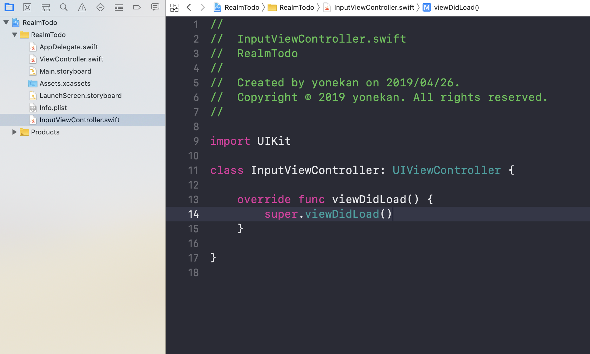
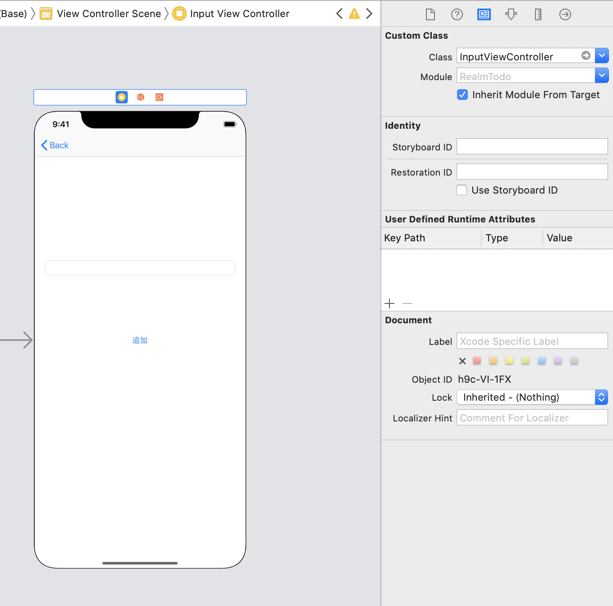
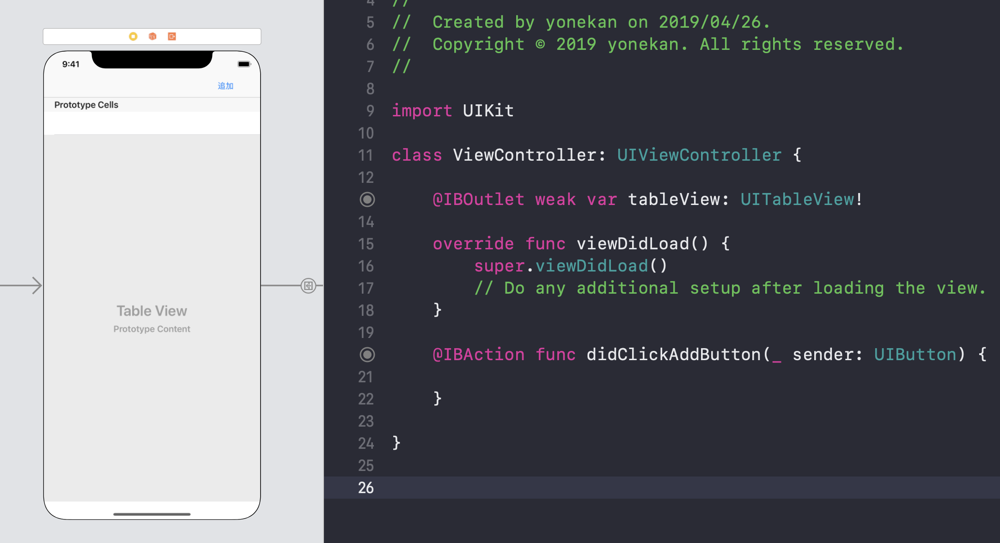
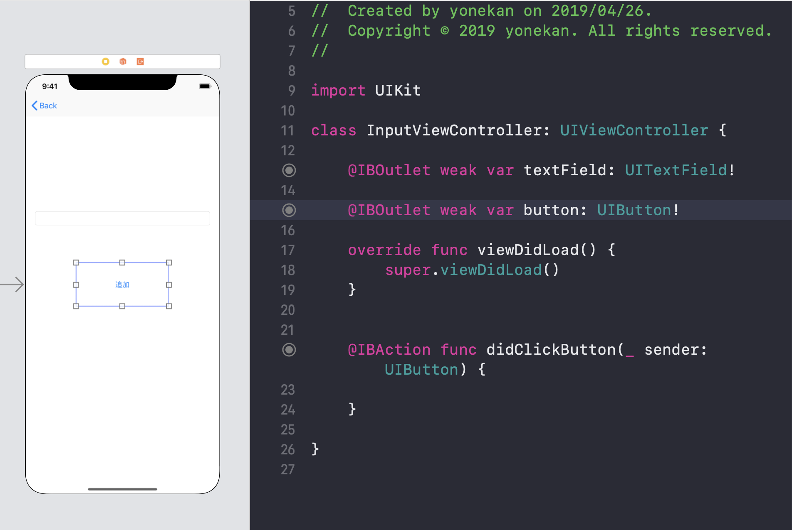

# RealmTodo

## 目標
- Realmが使えるようになる
- 役割や機能ごとにクラスを分けることができるようになる
- MVCについて理解する

## 作成するアプリ  
|タスク一覧|タスク追加|タスク編集|タスク削除|
|---|---|---|---|s
|||||

## 開発の流れ

1. 画面の部品を配置する
2. 配置した画面の部品をプログラムで扱えるよう設定する
3. RealmをCocoaPodsを使ってインストールする

## 開発しよう

1. プロジェクトを作成する  
	[01_はじめてのアプリ開発](./01_はじめてのアプリ開発.md)と同じように新規プロジェクトを作成する。  
	アプリ名：RealmTodo

2. 画面の部品を配置する

	1. NavigationControllerを追加する。  
	Main.storyboardでViewControllerを選択し、「Editor」→「Embed in」→「Navigation Controller」を選択する

		

	2. 以下のような画面になるよう部品を配置する  
		

	3. 以下のような別画面を作成し、部品を配置する  
		

	4. 2つのViewControllerが画面遷移するよう設定する
		

	5. 画面遷移の接続を表す矢印に識別子（名前）を設定する  
	矢印を選択し、ユーティリティエリアの属性インスペクタを選択する。  
	identifierに「toInputVC」と入力する。

		
	
	6. 2つ目の入力画面用のViewControllerを作成する。  
	class名：InputViewController

		
	
	7. Main.storyboardの2つ目の画面とInputVewController.swiftを接続する

		

3. 配置した画面の部品をプログラムで扱えるよう設定する

	1. 1つ目の画面の部品を設定する

		|部品|接続時のName|
		|---|---|
		|UITableView|tableView|
		|UIButton|didClickAddButton|

		


	2. 2つ目の画面の部品を設定する

		|部品|接続時のName|
		|---|---|
		|UITextField|textField|
		|UIButton|button|
		|UIButton|didClickButton|

		

4. RealmをCocoaPodsを使ってインストールする
	1. Podfileを作成し、```pod 'RealmSwift'```を追記。インストールをする