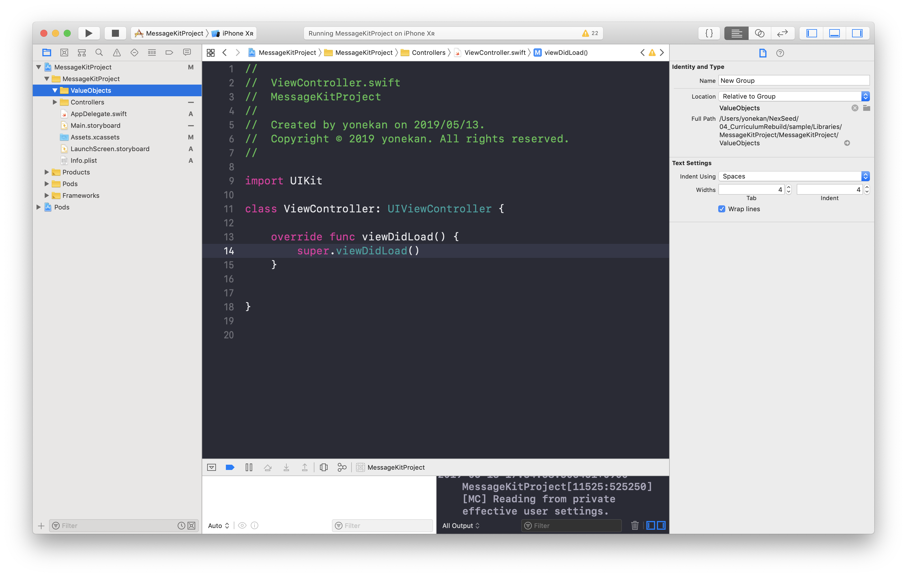

# MessageKit  

## 目標
- MessageKitライブラリが使えるようになる

## 使用するライブラリ
<a href="https://github.com/MessageKit/MessageKit">MessageKit</a>

## 作成するアプリ


## 開発の流れ
1. プロジェクトを作成する
2. 画面の部品を配置する
3. 画像を用意する
4. ViewControllerにDelegateとDataSourceを追記する
5. Kolodaの設定を追記する

## 開発しよう
1. プロジェクトを作成する

	1. プロジェクトを作成する  
	アプリ名：MessageKitProject
	
	2. CocoaPodsでMessageKitをインストールする
	
		```
		pod 'MessageKit'
		```

2. 画面の部品を配置する

	1. 以下のように画面のCustomClassを```MessagesViewController```に変更する  
		

	2. プロジェクトを実行してみる
		

3. 必要なグループとファイルを作成する

  1. 「Controllers」というグループを作成する。また作成したグループに```ViewController.swift```を移動する

    

  2. 「ValueObjects」というグループを作成する

    

	3. 作成した「ValueObjects」の中に以下のファイルを新規作成する

		- ChatUser.swift
		- Message.swift

		 

4. 必要なクラスを定義する

	1. 作成した```ChatUser.swift```にチャットのユーザーのデータを管理するクラスを追記する。  
	以下のプログラムを```ChatUser.swift```に追記する

		```swift
		import MessageKit

		/// チャットユーザーの情報を持つクラス
		class ChatUser {
    
    	/// ユーザーID
    	let uid: String
    
    	/// ユーザー名
    	let name: String
    
    	/// イニシャライザ
			///
			/// - Parameters:
			///   - uid: ユーザーID
			///   - name: ユーザー名
			init(uid: String, name: String) {
					self.uid = uid
					self.name = name
			}
		}
		```