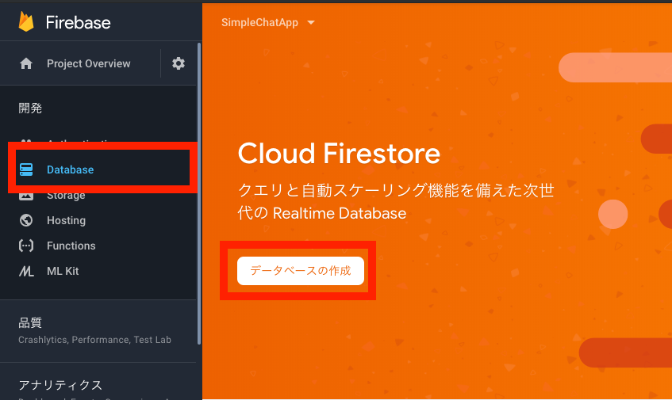
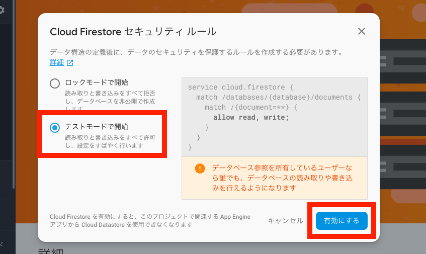
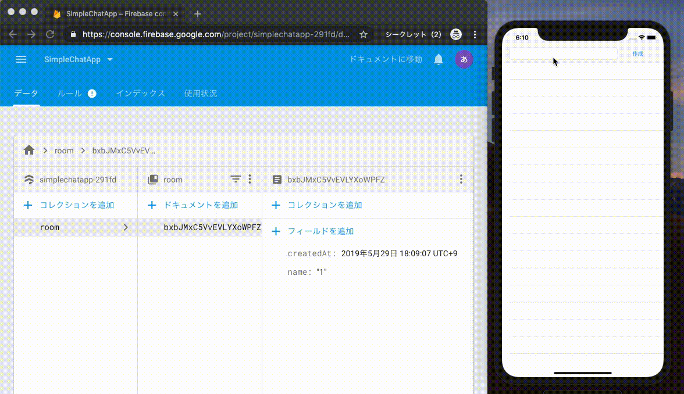

# Firestoreでシンプルなチャットアプリを作ろう（ルーム画面）

## 目標
- Firestoreが使えるようになる

## 作成するアプリ

## 開発の流れ

## 開発しよう
1. 全チャットルームを保持する配列を作成する

	1. 以下の変数を```ViewController.swift```に追加する

		```swift
		var rooms: [Room] = []
		```

		追加後の```ViewController.swift```

		```swift
		class ViewController: UIViewController {
			@IBOutlet weak var roomNameTextField: UITextField!
			
			@IBOutlet weak var tableView: UITableView!
			
			var rooms: [Room] = []
		```

	2. 作成した変数`rooms`の値が更新された時、TableViewをリロードするよう変数`rooms`に`didSet`を設定する

		編集後の変数`rooms`

		```swift
		var rooms: [Room] = [] {
			didSet {
				tableView.reloadData()
			}
		}
		```

2. TableViewを設定する

	1. `extension ViewController: UITableViewDataSource, UITableViewDelegate`をViewController.swiftに追記する。

		追記後のViewController.swift

		```swift
		class ViewController: UIViewController {
			@IBOutlet weak var roomNameTextField: UITextField!
			
			@IBOutlet weak var tableView: UITableView!
			
			// 省略
		}

		extension ViewController: UITableViewDataSource, UITableViewDelegate {

		}
		```

	2. 追記したextensionにTableViewの設定に必要なメソッドを追記する。

		追記後のextension

		```swift
		extension ViewController: UITableViewDataSource, UITableViewDelegate {
			
			func tableView(_ tableView: UITableView, numberOfRowsInSection section: Int) -> Int {
				<#code#>
			}
			
			func tableView(_ tableView: UITableView, cellForRowAt indexPath: IndexPath) -> UITableViewCell {
				<#code#>
			}
		}
		```

	3. `numberOfRowsInSection`メソッドを、チャットルーム数を返すよう修正する。

		追記後の`numberOfRowsInSection`メソッド

		```swift
		func tableView(_ tableView: UITableView, numberOfRowsInSection section: Int) -> Int {
			return rooms.count
		}
		```

	4. `cellForRowAt`メソッドを、チャットルーム名を表示するよう修正する。

		追記後の`cellForRowAt`メソッド

		```swift
		func tableView(_ tableView: UITableView, cellForRowAt indexPath: IndexPath) -> UITableViewCell {
			let cell = tableView.dequeueReusableCell(withIdentifier: "cell", for: indexPath)
			
			let room = rooms[indexPath.row]
			
			cell.textLabel?.text = room.name
			
			cell.accessoryType = .disclosureIndicator
			
			return cell
		}
		```

	5. `@IBOutlet weak var tableView: UITableView!`にここまでの設定を反映させる  
	`viewDidLoad`メソッドを以下のように修正する。

		修正後の`viewDidLoad`メソッド

		```swift
		override func viewDidLoad() {
			super.viewDidLoad()
			
			tableView.dataSource = self
			tableView.delegate = self
		}
		```

3. Firestoreを有効化する

	1. 作成中アプリのFirebaseプロジェクトのコンソールを表示する

	2. コンソールの「Database」を選択し、「データベースを作成」をクリックする

		

	3. 「テストモードで開始」を選択し、「有効にする」をクリックする

		

4. チャットルーム作成機能を追加する

	1. 作成ボタンがクリックされた時、ルーム名の空文字チェックをし、  
	空でない場合、ルーム名を変数に入れる処理を追記する。

		修正後の`didClickCreateRoomButton`メソッド

		```swift
		@IBAction func didClickCreateRoomButton(_ sender: UIButton) {
			if roomNameTextField.text!.isEmpty {
				// 空文字の場合は処理を中断する
				return
			}
			
			let roomName = roomNameTextField.text!
		}
		```

	2. Firebaseのimport文をViewController.swiftに追記する。

		追記後のViewController.swift

		```swift
		import UIKit
		import Firebase
		
		class ViewController: UIViewController {
		```

	3. チャットルームをFirestoreに登録する処理を追記する

		修正後の`didClickCreateRoomButton`メソッド

		```swift
		@IBAction func didClickCreateRoomButton(_ sender: UIButton) {
			
			if roomNameTextField.text!.isEmpty {
				// 空文字の場合は処理を中断する
				return
			}
			
			let roomName = roomNameTextField.text!
			
			let db = Firestore.firestore()
			
			db.collection("room").addDocument(data: [
				"name": roomName,
				"createdAt": FieldValue.serverTimestamp()
			]) {err in
				if let err = err {
					print("チャットルーム作成に失敗しました: \(err)")
				} else {
					print("チャットルームを作成しました：\(roomName)")
				}
			}

			roomNameTextField.text = ""
		}

		```

5. 実行してみる

	